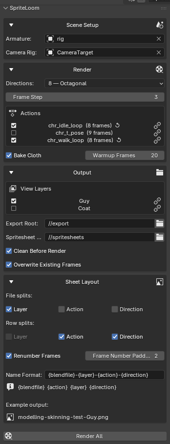

# SpriteLoom

Blender addon for rendering modular 2D character sprite sheets across all actions, clothing layers, and directions, ready for import into Unreal Engine.



## Features

- All actions in the file shown as checkboxes, all selected by default — click to include/exclude
- Looping animation support — actions with **Cyclic Animation** enabled exclude the duplicate last frame
- Navigate buttons on each action (jump to Animation workspace) and view layer (activate it)
- View layer selection via checkboxes (one per layer, all enabled by default)
- 1 / 4 / 8 / 16 direction rendering via camera rig rotation
- Configurable file and row splits: separate sheets per action, layer, and/or direction
- Configurable sheet naming via placeholders: `{blendfile}`, `{action}`, `{layer}`, `{direction}`
- Frame renumbering: JSON keys can be 0-based consecutive or original Blender frame numbers
- Configurable frame number zero-padding (default 2 digits)
- Live example output preview in the Sheet Layout panel
- Cloth simulation baking per view layer / action combination before rendering
- Clean Before Render option to wipe the export folder before each run
- Resume support — skips frames that already exist on disk (when clean is off)
- Auto-detects armature and camera rig from the scene
- N-panel UI with validation warnings and per-run summary

## Requirements

- Blender 5+

## Installation

1. Download the latest `spriteloom-*.zip` from the [Releases](../../releases) page
2. In Blender: **Edit > Preferences > Extensions > Install from Disk...**
3. Select the downloaded zip
4. Open the **3D Viewport**, press **N**, select the **SpriteLoom** tab

## Scene Setup

### Armature
The addon auto-detects a single armature in the scene, or falls back to common names (`rig`, `armature`, `metarig`). You can override it in the panel.

### Camera Rig
Parent your scene camera to an Empty. The addon auto-detects it and rotates it to render each direction.

### Actions
All actions in the file are shown in the panel as a checkbox list, all selected by default. Uncheck any you don't want rendered. For looping animations that should not repeat the last frame, enable **Cyclic Animation** on the action in the Action Editor (Action menu > Cyclic Animation, or the checkbox in the Action properties). SpriteLoom will automatically detect this and exclude the duplicate last frame.

### View Layers
Use one view layer per clothing/equipment layer (e.g. `Guy` for the base body, `Coat` for an overcoat). Within each view layer, configure object visibility and holdout to control exactly what appears in that render pass:

- **Visible**: objects that should appear in this layer's output (e.g. the body and the coat in the `Coat` layer)
- **Holdout**: objects that should punch a hole through everything behind them (e.g. the body in the `Coat` layer, so the coat is correctly masked against the character silhouette rather than the background)

This lets each layer produce a correctly composited RGBA image that can be layered in-engine.

All view layers are rendered by default; deselect individual layers in the panel to exclude them.

### Compositor
SpriteLoom renders via Blender's compositor. Set up the compositor with a **Render Layers** (View Layer) input node connected to your output. SpriteLoom automatically updates the View Layer input to the current layer before each render, so a single compositor graph handles all layers correctly without any manual switching.

The simplest setup: **Render Layers → Composite**. Any colour correction, alpha-over, or other nodes between them will be applied consistently to every layer and direction.

## Panel Reference

### Scene Setup
| Field | Description |
|---|---|
| Armature | Armature to read actions from |
| Camera Rig | Empty to rotate for direction changes |

### Render
| Field | Description |
|---|---|
| Directions | Number of render directions: 1 / 4 / 8 / 16 |
| Frame Step | Render every Nth frame |
| Actions | Checkbox list of all actions in the file — all selected by default; click to toggle, link button to navigate |
| Bake Cloth | Bake cloth simulations before rendering (per layer/action) |
| Warmup Frames | Extra frames baked before the action start |

### Output
| Field | Description |
|---|---|
| View Layers | Checkbox list of all view layers — all selected by default; click to toggle, link button to activate |
| Export Root | Folder for rendered frames (supports `//` blend-relative paths) |
| Spritesheet Root | Folder for packed sprite sheets |
| Clean Before Render | Delete all files in the export folder before starting |
| Overwrite Existing Frames | Re-render frames that already exist on disk |

### Sheet Layout
| Field | Description |
|---|---|
| File splits | Separate files per Action / Layer / Direction |
| Row splits | Separate rows per Action / Layer / Direction within a sheet |
| Renumber Frames | JSON frame keys are 0-based consecutive (off = original Blender frame numbers) |
| Frame Number Padding | Zero-pad width for frame number keys (default 2) |
| Name Format | Filename template using `{blendfile}`, `{action}`, `{layer}`, `{direction}` |

## Output

Rendered frames are written flat into the export folder:
```
export/
  {action}--{layer}--{direction}--{frame:04d}.png
```

Packed sprite sheets:
```
spritesheets/
  {name}.png
  {name}.json
```

## JSON Format

Sprite sheet metadata compatible with TexturePacker / Aseprite:

```json
{
  "meta": {
    "image": "myfile-Coat-walk-south.png",
    "size": { "w": 512, "h": 64 },
    "frameSize": { "w": 64, "h": 64 },
    "action": "walk",
    "layer": "Coat",
    "direction": "south",
    "frameCount": 8
  },
  "frames": [
    { "filename": "myfile-Coat-walk-south_00", "frame": { "x": 0, "y": 0, "w": 64, "h": 64 }, "duration": 100 }
  ]
}
```

## CLI Usage

```
blender --background myfile.blend --python spriteloom_render.py
```
